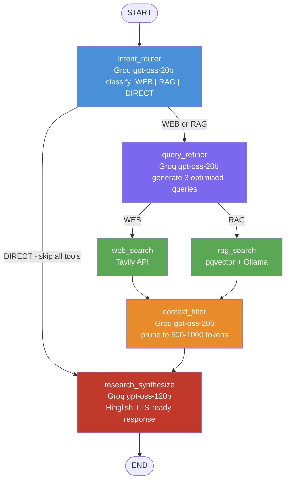

# High-Level Design (HLD) — Bol AI Voice Assistant

> **App:** `jeetu-code-assistant` | **Last Updated:** February 2026

---

## 1. Overview

**Bol AI** is a Hinglish voice assistant that allows users to have natural spoken conversations in Hindi/Hinglish. The system accepts audio or text input, processes it through an intelligent multi-agent AI pipeline, and returns a synthesised spoken response — all in Hinglish. It is built as a full-stack application with:

- A **Python FastAPI** backend hosting the AI pipeline and REST API
- A **React + Vite** frontend SPA
- A **Nginx** reverse proxy for HTTPS termination and routing
- **PostgreSQL** (with pgvector extension) as the primary database and vector store

---

## 2. System Architecture

### 2.1 Request Flow

```
User (Browser / Mobile)
         │
         │  HTTPS (port 8443)
         ▼
  ┌─────────────┐
  │    Nginx    │   Reverse Proxy + TLS termination
  └──────┬──────┘
         │
   ┌─────┴──────┐
   │            │
   ▼            ▼
/api/*       /*
FastAPI      Vite Dev Server
(port 8000)  (port 5173)
   │
   ├── POST /send-otp           Auth
   ├── POST /verify-otp         Auth
   ├── GET  /users/me           Auth
   ├── GET  /conversations      History
   ├── POST /conversations      History
   ├── POST /chat/transcribe    STT (Speech-to-Text) + Pre-balance check + Initial Ack Audio
   ├── POST /chat/text          LangGraph AI Inference + Optional TTS (Text-to-Speech)
   └── GET  /uploads/*          Static audio files
         │
         ▼
   LangGraph AI Pipeline
   (see diagram below)
         │
         ▼
 ┌─────────────────┐    ┌──────────────────────┐
 │  PostgreSQL DB  │    │   External APIs      │
 │  - users        │    │   - Groq (LLM)       │
 │  - conversations│    │   - Tavily (search)  │
 │  - messages     │    │   - Sarvam (STT+TTS) │
 │  - payments     │    │   - Ollama (embed)   │
 │  - pgvector     │    └──────────────────────┘
 └─────────────────┘
```

---

### 2.2 LangGraph Agent Pipeline




---

## 3. Component Breakdown

### 3.1 Nginx (Reverse Proxy)

| Responsibility | Detail |
|---|---|
| **TLS Termination** | Self-signed cert, TLSv1.2/1.3; HTTP on 8080 redirects to HTTPS 8443 |
| **API Routing** | `/api/*` → FastAPI on `localhost:8000` (strips `/api` prefix) |
| **Frontend Routing** | `/*` → Vite on `localhost:5173` with WebSocket upgrade support |
| **Upload Serving** | `/uploads/*` → proxied through FastAPI's static mount |
| **Upload Size Limit** | `client_max_body_size 50M` |
| **Timeouts** | API: 300s (long AI inference), uploads: 120s |

---

### 3.2 FastAPI Backend (`main.py`)

| Responsibility | Detail |
|---|---|
| **Application Host** | Uvicorn ASGI on `0.0.0.0:8000` |
| **CORS** | Allowed origins: `localhost:5173`, `localhost:3000` |
| **Middleware** | HTTP request/response logger middleware |
| **Static Files** | `uploads/` directory mounted at `/uploads` route |
| **DB Init** | SQLAlchemy `create_all()` runs on startup |
| **Routers** | `routes/auth.py` and `routes/chat.py` included |

---

### 3.3 Authentication (`src/auth.py`, `src/routes/auth.py`)

- **Mobile-first OTP flow**: User provides mobile number → OTP generated → verified → JWT issued
- **JWT**: HS256 algorithm, **30-day expiry** (`python-jose`)
- **OTP**: 6-digit, stored in DB, 5-minute expiry
- **All protected routes** use FastAPI `Depends(auth.get_current_user)` via `OAuth2PasswordBearer`

```
POST /send-otp  →  generate & store OTP (5 min TTL)
POST /verify-otp  →  validate OTP → return JWT Bearer token
GET /users/me   →  decode JWT → return user profile
```

> [!WARNING]
> **JWT 30-day expiry — Security Risk.** 30 days was chosen for "mobile app feel" (avoiding frequent re-logins). However this is a significant security vulnerability: if a token is stolen (e.g. through XSS, compromised device, API log leak), an attacker has up to **30 days of full account access** with no way to revoke it — because JWTs are stateless (there is no server-side token blacklist).
>
> **Recommended approach — Short-lived access + refresh token:**
> - **Access token**: 1 hour (or at most 1 day) — short-lived, stateless
> - **Refresh token**: 7–14 days — stored in the DB, revocable per-user or per-device
>
> For this app's current stage (dev/demo, no SMS OTP in prod), **reducing to 7 days** is a safe minimum improvement with zero UX change on mobile.


---

### 3.4 LangGraph Agent Pipeline (`src/graph.py`)

The AI pipeline is a **directed acyclic graph (DAG)** built with LangGraph's `StateGraph`. All state is typed with `BolState` (TypedDict).

#### Intent Classification (3 categories)

| Intent | Use Case | Example |
|---|---|---|
| `WEB` | Live/current data needed | "What's the weather today?" |
| `RAG` | Project code/doc lookup | "Explain the auth flow in my project" |
| `DIRECT` | General knowledge, math, advice | "What is 2 + 2?" |

#### Reasoning Levels

| Level | Use Case |
|---|---|
| `low` | Simple factual lookups or greetings |
| `med` | Multi-step or comparative questions |
| `high` | Complex analysis, code generation |

#### Model Assignments

| Node | Model | Purpose |
|---|---|---|
| Guardrail layer | **Groq `gpt-oss-20b`** | ~1000 tokens/sec, ultra-fast routing & filtering |
| Synthesis layer | **Groq `gpt-oss-120b`** | Maximum reasoning capability |

#### Context Window Management

- Max context: **131,072 tokens** (524,288 chars)
- History: last **6 turns** (12 messages) sent to each node
- Proportional truncation applied when history exceeds budget

#### Singleton Graph — Concurrency Safety

The compiled LangGraph object (`_graph`) is a **module-level singleton** built once at startup:

```python
_graph = _build_graph()   # compiled once at import time
```

**Is this safe when two users are simultaneously using the app?** ✅ **Yes — fully safe**, for these reasons:

1. **The compiled graph is read-only.** `g.compile()` returns an immutable execution engine (like a function). It holds no per-request state internally.

2. **Each call creates its own isolated state.** `run_graph()` constructs a fresh `initial_state` dict (messages, intent, queries etc.) for every request. Two simultaneous calls produce two completely separate state objects that never touch each other.

3. **No checkpointer is attached.** The graph is compiled with `g.compile()` — no `MemorySaver` or DB checkpointer — so there is no shared in-memory store between invocations.

4. **`thread_id` namespacing.** The config key `user_{id}_conv_{id}` scopes each session independently (useful if a checkpointer is added later).

> [!NOTE]
> The singleton pattern here is purely a performance optimisation — avoiding the overhead of re-compiling the graph (which involves node registration and edge validation) on every request. It is the correct and recommended approach.


---

### 3.5 Speech Handlers

#### STT (`src/stt_handler.py`) — Sarvam AI `saaras:v3`

Two API calls per transcription:
1. **`translate` mode** → English output (passed to LangGraph for reasoning)
2. **`translit` mode** → Hinglish/Devanagari (shown in UI, used in query context)

Audio is converted from `.webm` → `.wav` via `ffmpeg` subprocess before sending to Sarvam.

#### TTS (`src/tts_handler.py`) — Sarvam AI `bulbul:v3`

- Streaming MP3 audio response
- Female voice: `"ritu"`, Hindi-IN language
- Speech rate: 1.2x, 22050 Hz sample rate
- Markdown symbols are stripped before synthesis

---

### 3.6 RAG Ingestion (`ingest.py`)

| Step | Tool |
|---|---|
| File discovery | Recursive scan for `.py`, `.ts`, `.tsx`, `.md`, `.json`, `.yaml` etc. |
| Text splitting | `RecursiveCharacterTextSplitter` (1000 chars, 200 overlap) |
| Embedding | **Ollama `mxbai-embed-large`** (local, self-hosted) |
| Vector storage | **pgvector** in PostgreSQL, collection: `bol_ai_docs` |

Ingest is a CLI script run manually before deploying; re-runs do a full refresh (`pre_delete_collection=True`).

---

### 3.7 Database (PostgreSQL + pgvector)

| Table | Key Fields |
|---|---|
| `users` | `id`, `mobile_number` (unique), `otp`, `otp_expiry`, `full_name`, `credits_balance`, `plan_type` |
| `conversations` | `id`, `title`, `user_id` (FK), `created_at` |
| `messages` | `id`, `conversation_id` (FK), `role` (user/assistant), `content`, `audio_url`, `created_at` |
| `payments` | `id`, `user_id` (FK), `amount`, `currency`, `status`, `created_at` |
| `pgvector store` | LangChain-managed `bol_ai_docs` collection for RAG embeddings |

---

## 4. External API Dependencies

| Service | Used For | SDK / Library |
|---|---|---|
| **Groq** | LLM inference (routing, filtering, synthesis) | `langchain-groq` |
| **Sarvam AI** | STT (Saaras v3) + TTS (Bulbul v3) | `sarvamai` |
| **Tavily** | Live web search for `WEB` intent queries | `tavily-python` |
| **Ollama** | Local embeddings (`mxbai-embed-large`) for RAG | `langchain-ollama` |

---

## 5. Python Library Dependencies

| Library | Version | Purpose |
|---|---|---|
| `fastapi` | ≥0.110 | Web framework |
| `uvicorn` | ≥0.27 | ASGI server |
| `sqlalchemy` | ≥2.0 | ORM |
| `pydantic` | ≥2.0 | Request/response schemas |
| `langgraph` | ≥0.6 | Agent pipeline orchestration |
| `langchain-core` | ≥0.3 | LangChain message types |
| `langchain-groq` | ≥0.3 | Groq LLM integration |
| `langchain-ollama` | ≥0.3 | Ollama embeddings |
| `langchain-postgres` | ≥0.0.17 | pgvector vector store |
| `langchain-community` | ≥0.3 | Document loaders |
| `tavily-python` | ≥0.7 | Web search |
| `sarvamai` | latest | Sarvam STT + TTS SDK |
| `python-jose[cryptography]` | ≥3.3 | JWT auth |
| `passlib[bcrypt]` | ≥1.7 | Password/OTP hashing |
| `psycopg2-binary` | ≥2.9 | PostgreSQL driver (SQLAlchemy) |
| `psycopg[binary,pool]` | ≥3.2 | PostgreSQL driver (pgvector) |
| `pgvector` | ≥0.3 | pgvector Python bindings |
| `python-multipart` | ≥0.0.9 | File upload support |
| `python-dotenv` | ≥1.2 | `.env` config loading |
| `requests` | ≥2.32 | HTTP client (TTS streaming) |
| `sounddevice` | ≥0.4 | Audio playback (local dev) |
| `soundfile` | ≥0.12 | Audio file I/O |
| `scipy` | ≥1.11 | Signal processing |
| `numpy` | ≥1.26 | Numerical arrays |

---

## 6. Chat Flow — End-to-End (Split Pipeline)

To prevent UI blocking and improve user experience, the chat pipeline is split into two rapid requests:

### Phase 1: Rapid Transcription & Acknowledgement (`POST /chat/transcribe`)

```
1. User records audio in browser → uploads to /chat/transcribe
2. Fast DB check: `current_user.credits_balance > 0`
3. stt_handler.transcribe():
   a. [Sarvam translate] → English text (for AI reasoning)
   b. [Sarvam translit] → Hinglish text (for UI display)
4. Application instantly returns {"translated_text": "...", "translit_text": "..."} back to UI.
5. (Optional) A quick "Thinking..." fallback audio track is returned to keep the user engaged.
```

### Phase 2: AI Reasoning and TTS (`POST /chat/text`)

```
1. Frontend instantly paints the user's recognized text bubble.
2. Frontend immediately fires HTTP POST to `/chat/text` with the English text payload.
3. User message formally saved to DB (messages table), 1 credit deducted.
4. graph.run_graph() → LangGraph DAG:
   a. intent_router  → classify: WEB | RAG | DIRECT
   b. query_refiner  → 3 optimised queries (skip if DIRECT)
   c. web_search OR rag_search (skip if DIRECT)
   d. context_filter → prune to 500-1000 tokens (skip if DIRECT)
   e. research_synthesize → Hinglish TTS-ready response
5. tts_handler.generate_audio() → [Sarvam bulbul:v3] → MP3 file
6. AI message + audio_url saved to DB
7. Response returned: {ai_message} ready for immediate playback in the frontend.
```

---

## 7. Startup Script (`deploy_dev.sh`)

Orchestrates all components for local development:
1. Ensures PostgreSQL is running with pgvector extension enabled
2. Starts FastAPI backend (Uvicorn)
3. Starts Vite frontend dev server
4. Starts Nginx reverse proxy (HTTPS)
